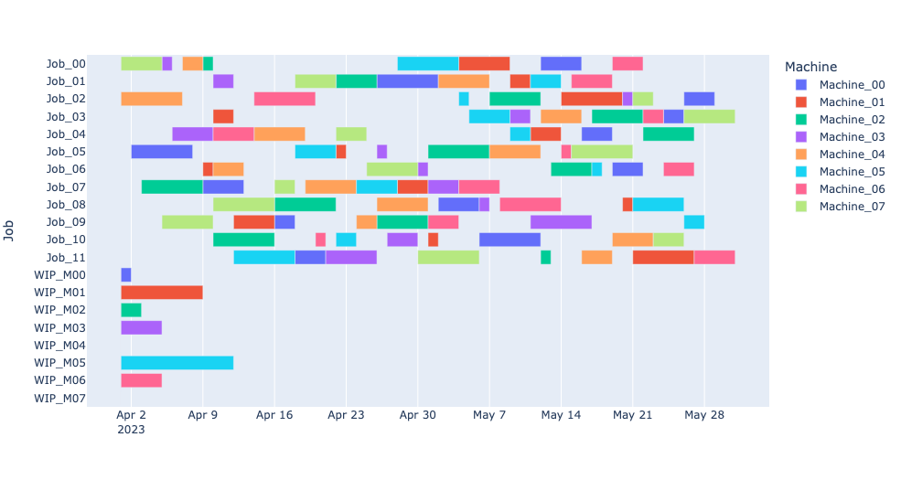

# Optimization-Using-Python

- [Implementation of Optimization Model Using Python/Pulp](CredLimOptimization.py)

- [Example of Nonlinear Optimization Using scipy.optimize](NonlinearProgrammingUsingPython.ipynb)

- [Job Shop Scheduling Using Google ortools](SimpleJobShopScheduling.ipynb)

Example Output: 
