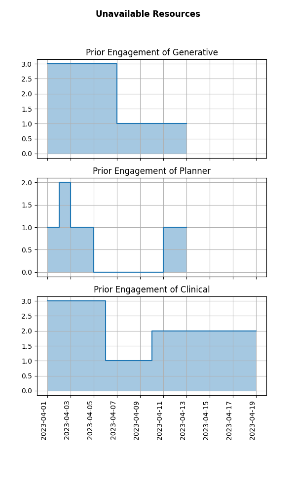

## Model Inputs
### Project Summary

|                          | longasap   | long   | regsize   | short   |
|:-------------------------|:-----------|:-------|:----------|:--------|
| Plan_Project             | 2          | 2      | 2         | 2       |
| Design_Exp               | 2          | 2      | 2         | 2       |
| Soln_Pass_A              | 8          | 8      | 8         | 12      |
| Eval_Pass_A              | 1          | 1      | 1         | 1       |
| Soln_Pass_B              | 4          | 4      | 4         |         |
| Eval_Pass_B              | 1          | 1      | 1         |         |
| Soln_Pass_C              | 3          | 3      |           |         |
| Eval_Pass_C              | 1          | 1      |           |         |
| Clinical_Study_Design    | 1          | 1      | 1         | 1       |
| Clinical_Study_Execution | 8          | 8      | 6         | 8       |
| Clinical_Study_Report    | 1          | 1      |           | 1       |
| Documentation_to_Client  | 3          | 3      | 3         |         |
| ------------             |            |        |           |         |
| MIN TIME REQ             | 35         | 35     | 28        | 27      |
| DEADLINE                 | 33         | 40     | 45        | 50      |

### Project Priorities

| Project      |   Delay Penalty |     Early Bonus |
| :------      |   ------------: |     ----------: |
| longasap     |               4 |               1 |
| long         |               3 |               1 |
| regsize      |               2 |             0.5 |
| short        |               2 |             0.1 |

### Resource Utilization At Time 0

# Optimization Results

- Solution Status: OPTIMAL
	- Optimal Objective Value: 7.300
	- Optimal Objective Bound: 7.300

### Project Completion Report
| Project    | Completion |  Early |  Tardy |
| :------    | ---------: |  ----: |  ----: |
| longasap   |         37 |      0 |      4 |
| long       |         39 |      1 |      0 |
| regsize    |         32 |     13 |      0 |
| short      |         38 |     12 |      0 |

## Optimal Timetable

## Optimal Resource Utilization

