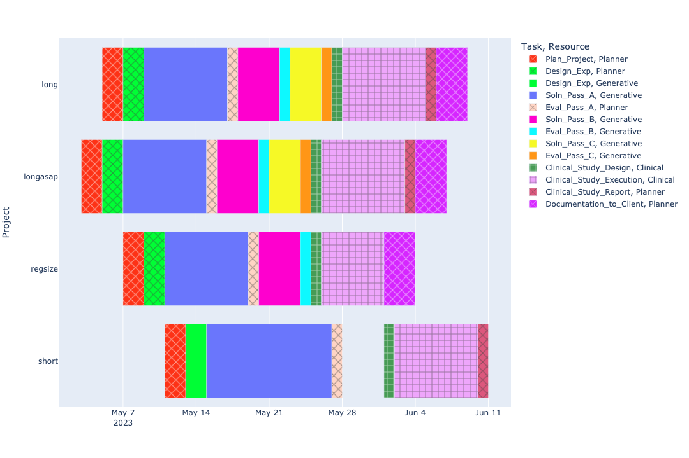
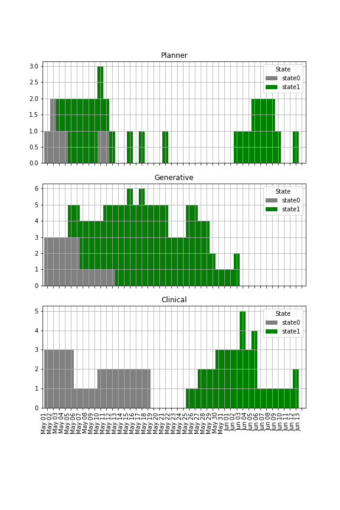

## Model Inputs

### Project Attributes

| Project   |   Deadline |   Delay Penalty |   Early Bonus |
|:----------|-----------:|----------------:|--------------:|
| longasap  |         33 |               4 |           1   |
| long      |         40 |               3 |           1   |
| regsize   |         45 |               2 |           0.5 |
| short     |         50 |               2 |           0.1 |

### Project Requirements

| Project   | Task                     | Resource   |   Duration |   Units |
|:----------|:-------------------------|:-----------|-----------:|--------:|
| longasap  | Plan_Project             | Planner    |          2 |       1 |
| longasap  | Design_Exp               | Generative |          2 |       2 |
| longasap  | Design_Exp               | Planner    |          2 |       1 |
| longasap  | Soln_Pass_A              | Generative |          8 |       1 |
| longasap  | Eval_Pass_A              | Generative |          1 |       2 |
| longasap  | Eval_Pass_A              | Planner    |          1 |       1 |
| longasap  | Soln_Pass_B              | Generative |          4 |       1 |
| longasap  | Eval_Pass_B              | Generative |          1 |       1 |
| longasap  | Soln_Pass_C              | Generative |          3 |       1 |
| longasap  | Eval_Pass_C              | Generative |          1 |       1 |
| longasap  | Clinical_Study_Design    | Clinical   |          1 |       1 |
| longasap  | Clinical_Study_Execution | Clinical   |          8 |       1 |
| longasap  | Clinical_Study_Report    | Clinical   |          1 |       2 |
| longasap  | Clinical_Study_Report    | Planner    |          1 |       1 |
| longasap  | Documentation_to_Client  | Planner    |          3 |       1 |
| long      | Plan_Project             | Planner    |          2 |       1 |
| long      | Design_Exp               | Generative |          2 |       2 |
| long      | Design_Exp               | Planner    |          2 |       1 |
| long      | Soln_Pass_A              | Generative |          8 |       1 |
| long      | Eval_Pass_A              | Generative |          1 |       2 |
| long      | Eval_Pass_A              | Planner    |          1 |       1 |
| long      | Soln_Pass_B              | Generative |          4 |       1 |
| long      | Eval_Pass_B              | Generative |          1 |       1 |
| long      | Soln_Pass_C              | Generative |          3 |       1 |
| long      | Eval_Pass_C              | Generative |          1 |       1 |
| long      | Clinical_Study_Design    | Clinical   |          1 |       1 |
| long      | Clinical_Study_Execution | Clinical   |          8 |       1 |
| long      | Clinical_Study_Report    | Clinical   |          1 |       2 |
| long      | Clinical_Study_Report    | Planner    |          1 |       1 |
| long      | Documentation_to_Client  | Planner    |          3 |       1 |
| regsize   | Plan_Project             | Planner    |          2 |       1 |
| regsize   | Design_Exp               | Generative |          2 |       2 |
| regsize   | Design_Exp               | Planner    |          2 |       1 |
| regsize   | Soln_Pass_A              | Generative |          8 |       1 |
| regsize   | Eval_Pass_A              | Generative |          1 |       2 |
| regsize   | Eval_Pass_A              | Planner    |          1 |       1 |
| regsize   | Soln_Pass_B              | Generative |          4 |       1 |
| regsize   | Eval_Pass_B              | Generative |          1 |       1 |
| regsize   | Clinical_Study_Design    | Clinical   |          1 |       1 |
| regsize   | Clinical_Study_Execution | Clinical   |          6 |       1 |
| regsize   | Documentation_to_Client  | Planner    |          3 |       1 |
| short     | Plan_Project             | Planner    |          2 |       1 |
| short     | Design_Exp               | Generative |          2 |       1 |
| short     | Design_Exp               | Planner    |          2 |       1 |
| short     | Soln_Pass_A              | Generative |         12 |       1 |
| short     | Eval_Pass_A              | Generative |          1 |       2 |
| short     | Eval_Pass_A              | Planner    |          1 |       1 |
| short     | Clinical_Study_Design    | Clinical   |          1 |       1 |
| short     | Clinical_Study_Execution | Clinical   |          8 |       1 |
| short     | Clinical_Study_Report    | Clinical   |          1 |       2 |
| short     | Clinical_Study_Report    | Planner    |          1 |       1 |

### Resource Attributes

| Resource   |   Capacity |   Cost per Day |
|:-----------|-----------:|---------------:|
| Planner    |          2 |           1000 |
| Generative |          5 |            700 |
| Clinical   |          3 |            800 |

# Optimization Results

- Solution Status: OPTIMAL
	- Optimal Objective Value: 99,908.600
	- Optimal Objective Bound: 99,908.600

### Project Completion Report
| Project    | Completion |  Early |  Tardy |
| :------    | ---------: |  ----: |  ----: |
| longasap   |         37 |      0 |      4 |
| long       |         39 |      1 |      0 |
| regsize    |         34 |     11 |      0 |
| short      |         41 |      9 |      0 |

## Optimal Timetable

## Optimal Resource Utilization

