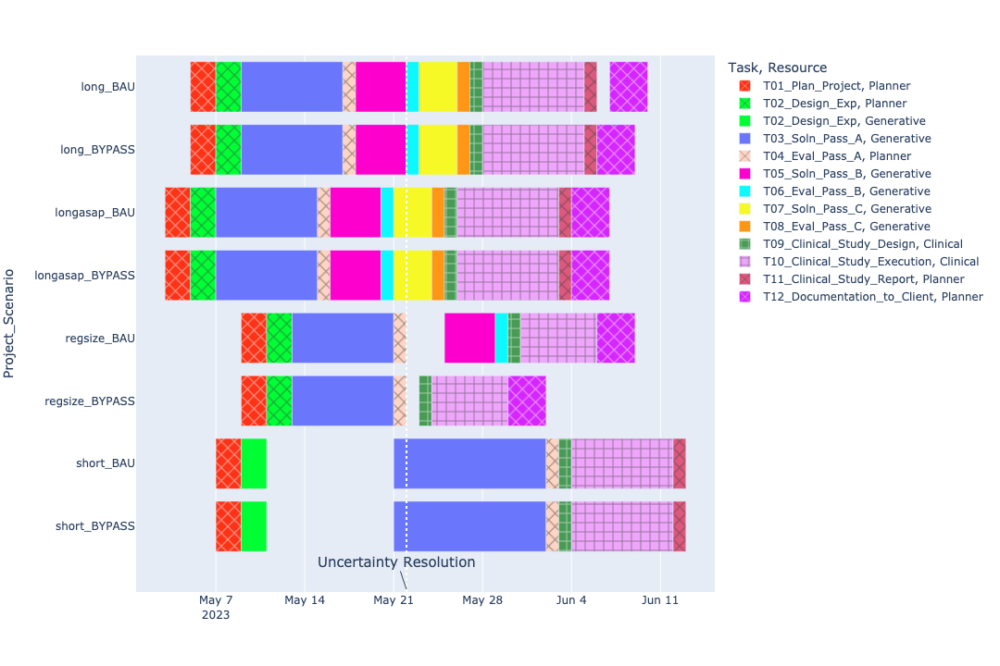

## Model Inputs

### Project Attributes

| Project   |   Deadline |   Delay Penalty |   Early Bonus |
|:----------|-----------:|----------------:|--------------:|
| longasap  |         33 |               4 |           1   |
| long      |         40 |               3 |           1   |
| regsize   |         38 |               2 |           0.5 |
| short     |         42 |               1 |           0.1 |

### Project Requirements

| Scenario   | Project   | Task                         | Resource   |   Duration |   Units |
|:-----------|:----------|:-----------------------------|:-----------|-----------:|--------:|
| BAU        | long      | T01_Plan_Project             | Planner    |          2 |       1 |
| BAU        | long      | T02_Design_Exp               | Generative |          2 |       2 |
| BAU        | long      | T02_Design_Exp               | Planner    |          2 |       1 |
| BAU        | long      | T03_Soln_Pass_A              | Generative |          8 |       1 |
| BAU        | long      | T04_Eval_Pass_A              | Generative |          1 |       2 |
| BAU        | long      | T04_Eval_Pass_A              | Planner    |          1 |       1 |
| BAU        | long      | T05_Soln_Pass_B              | Generative |          4 |       1 |
| BAU        | long      | T06_Eval_Pass_B              | Generative |          1 |       1 |
| BAU        | long      | T07_Soln_Pass_C              | Generative |          3 |       1 |
| BAU        | long      | T08_Eval_Pass_C              | Generative |          1 |       1 |
| BAU        | long      | T09_Clinical_Study_Design    | Clinical   |          1 |       1 |
| BAU        | long      | T10_Clinical_Study_Execution | Clinical   |          8 |       1 |
| BAU        | long      | T11_Clinical_Study_Report    | Clinical   |          1 |       2 |
| BAU        | long      | T11_Clinical_Study_Report    | Planner    |          1 |       1 |
| BAU        | long      | T12_Documentation_to_Client  | Planner    |          3 |       1 |
| BAU        | longasap  | T01_Plan_Project             | Planner    |          2 |       1 |
| BAU        | longasap  | T02_Design_Exp               | Generative |          2 |       2 |
| BAU        | longasap  | T02_Design_Exp               | Planner    |          2 |       1 |
| BAU        | longasap  | T03_Soln_Pass_A              | Generative |          8 |       1 |
| BAU        | longasap  | T04_Eval_Pass_A              | Generative |          1 |       2 |
| BAU        | longasap  | T04_Eval_Pass_A              | Planner    |          1 |       1 |
| BAU        | longasap  | T05_Soln_Pass_B              | Generative |          4 |       1 |
| BAU        | longasap  | T06_Eval_Pass_B              | Generative |          1 |       1 |
| BAU        | longasap  | T07_Soln_Pass_C              | Generative |          3 |       1 |
| BAU        | longasap  | T08_Eval_Pass_C              | Generative |          1 |       1 |
| BAU        | longasap  | T09_Clinical_Study_Design    | Clinical   |          1 |       1 |
| BAU        | longasap  | T10_Clinical_Study_Execution | Clinical   |          8 |       1 |
| BAU        | longasap  | T11_Clinical_Study_Report    | Clinical   |          1 |       2 |
| BAU        | longasap  | T11_Clinical_Study_Report    | Planner    |          1 |       1 |
| BAU        | longasap  | T12_Documentation_to_Client  | Planner    |          3 |       1 |
| BAU        | regsize   | T01_Plan_Project             | Planner    |          2 |       1 |
| BAU        | regsize   | T02_Design_Exp               | Generative |          2 |       2 |
| BAU        | regsize   | T02_Design_Exp               | Planner    |          2 |       1 |
| BAU        | regsize   | T03_Soln_Pass_A              | Generative |          8 |       3 |
| BAU        | regsize   | T04_Eval_Pass_A              | Generative |          1 |       2 |
| BAU        | regsize   | T04_Eval_Pass_A              | Planner    |          1 |       1 |
| BAU        | regsize   | T05_Soln_Pass_B              | Generative |          4 |       3 |
| BAU        | regsize   | T06_Eval_Pass_B              | Generative |          1 |       1 |
| BAU        | regsize   | T09_Clinical_Study_Design    | Clinical   |          1 |       1 |
| BAU        | regsize   | T10_Clinical_Study_Execution | Clinical   |          6 |       1 |
| BAU        | regsize   | T12_Documentation_to_Client  | Planner    |          3 |       1 |
| BAU        | short     | T01_Plan_Project             | Planner    |          2 |       1 |
| BAU        | short     | T02_Design_Exp               | Generative |          2 |       1 |
| BAU        | short     | T02_Design_Exp               | Planner    |          2 |       1 |
| BAU        | short     | T03_Soln_Pass_A              | Generative |         12 |       1 |
| BAU        | short     | T04_Eval_Pass_A              | Generative |          1 |       2 |
| BAU        | short     | T04_Eval_Pass_A              | Planner    |          1 |       1 |
| BAU        | short     | T09_Clinical_Study_Design    | Clinical   |          1 |       1 |
| BAU        | short     | T10_Clinical_Study_Execution | Clinical   |          8 |       1 |
| BAU        | short     | T11_Clinical_Study_Report    | Clinical   |          1 |       2 |
| BAU        | short     | T11_Clinical_Study_Report    | Planner    |          1 |       1 |
| BYPASS     | long      | T01_Plan_Project             | Planner    |          2 |       1 |
| BYPASS     | long      | T02_Design_Exp               | Generative |          2 |       2 |
| BYPASS     | long      | T02_Design_Exp               | Planner    |          2 |       1 |
| BYPASS     | long      | T03_Soln_Pass_A              | Generative |          8 |       1 |
| BYPASS     | long      | T04_Eval_Pass_A              | Generative |          1 |       2 |
| BYPASS     | long      | T04_Eval_Pass_A              | Planner    |          1 |       1 |
| BYPASS     | long      | T05_Soln_Pass_B              | Generative |          4 |       1 |
| BYPASS     | long      | T06_Eval_Pass_B              | Generative |          1 |       1 |
| BYPASS     | long      | T07_Soln_Pass_C              | Generative |          3 |       1 |
| BYPASS     | long      | T08_Eval_Pass_C              | Generative |          1 |       1 |
| BYPASS     | long      | T09_Clinical_Study_Design    | Clinical   |          1 |       1 |
| BYPASS     | long      | T10_Clinical_Study_Execution | Clinical   |          8 |       1 |
| BYPASS     | long      | T11_Clinical_Study_Report    | Clinical   |          1 |       2 |
| BYPASS     | long      | T11_Clinical_Study_Report    | Planner    |          1 |       1 |
| BYPASS     | long      | T12_Documentation_to_Client  | Planner    |          3 |       1 |
| BYPASS     | longasap  | T01_Plan_Project             | Planner    |          2 |       1 |
| BYPASS     | longasap  | T02_Design_Exp               | Generative |          2 |       2 |
| BYPASS     | longasap  | T02_Design_Exp               | Planner    |          2 |       1 |
| BYPASS     | longasap  | T03_Soln_Pass_A              | Generative |          8 |       1 |
| BYPASS     | longasap  | T04_Eval_Pass_A              | Generative |          1 |       2 |
| BYPASS     | longasap  | T04_Eval_Pass_A              | Planner    |          1 |       1 |
| BYPASS     | longasap  | T05_Soln_Pass_B              | Generative |          4 |       1 |
| BYPASS     | longasap  | T06_Eval_Pass_B              | Generative |          1 |       1 |
| BYPASS     | longasap  | T07_Soln_Pass_C              | Generative |          3 |       1 |
| BYPASS     | longasap  | T08_Eval_Pass_C              | Generative |          1 |       1 |
| BYPASS     | longasap  | T09_Clinical_Study_Design    | Clinical   |          1 |       1 |
| BYPASS     | longasap  | T10_Clinical_Study_Execution | Clinical   |          8 |       1 |
| BYPASS     | longasap  | T11_Clinical_Study_Report    | Clinical   |          1 |       2 |
| BYPASS     | longasap  | T11_Clinical_Study_Report    | Planner    |          1 |       1 |
| BYPASS     | longasap  | T12_Documentation_to_Client  | Planner    |          3 |       1 |
| BYPASS     | regsize   | T01_Plan_Project             | Planner    |          2 |       1 |
| BYPASS     | regsize   | T02_Design_Exp               | Generative |          2 |       2 |
| BYPASS     | regsize   | T02_Design_Exp               | Planner    |          2 |       1 |
| BYPASS     | regsize   | T03_Soln_Pass_A              | Generative |          8 |       3 |
| BYPASS     | regsize   | T04_Eval_Pass_A              | Generative |          1 |       2 |
| BYPASS     | regsize   | T04_Eval_Pass_A              | Planner    |          1 |       1 |
| BYPASS     | regsize   | T09_Clinical_Study_Design    | Clinical   |          1 |       1 |
| BYPASS     | regsize   | T10_Clinical_Study_Execution | Clinical   |          6 |       1 |
| BYPASS     | regsize   | T12_Documentation_to_Client  | Planner    |          3 |       1 |
| BYPASS     | short     | T01_Plan_Project             | Planner    |          2 |       1 |
| BYPASS     | short     | T02_Design_Exp               | Generative |          2 |       1 |
| BYPASS     | short     | T02_Design_Exp               | Planner    |          2 |       1 |
| BYPASS     | short     | T03_Soln_Pass_A              | Generative |         12 |       1 |
| BYPASS     | short     | T04_Eval_Pass_A              | Generative |          1 |       2 |
| BYPASS     | short     | T04_Eval_Pass_A              | Planner    |          1 |       1 |
| BYPASS     | short     | T09_Clinical_Study_Design    | Clinical   |          1 |       1 |
| BYPASS     | short     | T10_Clinical_Study_Execution | Clinical   |          8 |       1 |
| BYPASS     | short     | T11_Clinical_Study_Report    | Clinical   |          1 |       2 |
| BYPASS     | short     | T11_Clinical_Study_Report    | Planner    |          1 |       1 |

### Resource Attributes

| Resource   |   Capacity |   Cost per Day |
|:-----------|-----------:|---------------:|
| Planner    |          2 |           1000 |
| Generative |          5 |            700 |
| Clinical   |          3 |            800 |

# Optimization Results

- Solution Status: OPTIMAL
	- Optimal Objective Value: 113,076.600
	- Optimal Objective Bound: 113,076.600

### Project Completion Report
| Scenario   | Project    | Completion |  Early |  Tardy |
| :-------   | :------    | ---------: |  ----: |  ----: |
| BAU        | longasap   |         37 |      0 |      4 |
| BAU        | long       |         40 |      0 |      0 |
| BAU        | regsize    |         39 |      0 |      1 |
| BAU        | short      |         43 |      0 |      1 |
| BYPASS     | longasap   |         37 |      0 |      4 |
| BYPASS     | long       |         39 |      1 |      0 |
| BYPASS     | regsize    |         32 |      6 |      0 |
| BYPASS     | short      |         43 |      0 |      1 |

## Optimal Timetable

## Optimal Resource Utilization

